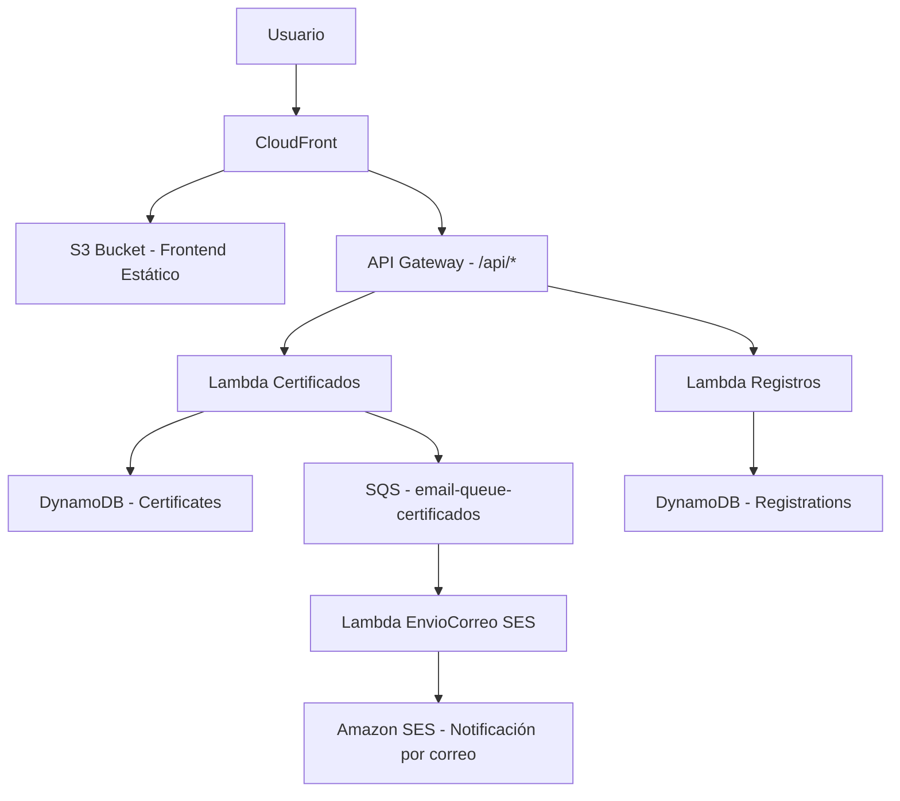

## Problema

Una plataforma de cursos virtuales presentaba fallos críticos durante procesos clave como el registro de nuevos usuarios y la emisión de certificados al finalizar los cursos. Durante periodos de alta demanda —como el cierre de ciclos formativos o inscripciones masivas—, el sistema sufría demoras significativas, errores intermitentes y saturación en los servicios encargados del almacenamiento y procesamiento de solicitudes. Esta inestabilidad afectaba la experiencia de los usuarios, generaba pérdidas de confianza y dificultaba el escalado eficiente del servicio ante el crecimiento de la base estudiantil.

---

## Descripción Técnica de la Infraestructura en AWS

Esta infraestructura, desplegada mediante Terraform, implementa un sistema de gestión de certificados, registros de usuarios y envío de notificaciones, utilizando servicios serverless de AWS. Está organizada en módulos funcionales que integran **API Gateway**, **AWS Lambda**, **DynamoDB**, **SQS**, **SES**, **CloudFront** y **S3**, con seguridad habilitada mediante **IAM** y **KMS**.

---

### 1. API Gateway

Se define un `Rest API` llamado `RecursosAPI` con dos endpoints:

* `POST /certificados`: Integrado con una función Lambda para procesar certificados.
* `POST /registros`: Integrado con otra función Lambda que maneja registros de usuarios.

Ambos endpoints están expuestos bajo el **stage `prod`**. Se establecen permisos explícitos para permitir a API Gateway invocar las funciones Lambda correspondientes.

---

### 2. Funciones Lambda

Se crean tres funciones Lambda en Node.js 16.x:

* **certificates**: Gestiona lógica de generación de certificados, almacenando en DynamoDB y enviando notificaciones a la cola SQS.
* **registrations**: Maneja el registro de usuarios, almacenando datos en la tabla `Registrations`.
* **emailSender**: Función dedicada a consumir mensajes desde SQS y enviar correos electrónicos utilizando Amazon SES.

Cada función tiene un execution role con permisos específicos, y variables de entorno para interactuar con recursos como DynamoDB, SQS y SES.

---

### 3. DynamoDB

Se implementan dos tablas:

* **Certificates**: Usa `certificateId` como clave primaria. Incluye índices secundarios globales (`UserIdIndex`, `StatusIndex`) para búsquedas avanzadas.
* **Registrations**: Usa clave compuesta `userId + email`. Incluye índices para `email` y `accountType`.

Características comunes:

* Encriptación con KMS.
* TTL habilitado (`expirationDate`).
* **Point-in-Time Recovery** activado (solo para `Registrations`).

---

### 4. SQS (Simple Queue Service)

Se implementa una cola SQS llamada `email-queue-certificados` para desacoplar el proceso de generación de certificados del envío de notificaciones por correo.

* La Lambda `certificates` envía mensajes a la cola.
* La Lambda `emailSender` es invocada automáticamente al recibir mensajes y se encarga de enviar el correo.

---

### 5. SES (Simple Email Service)

Se configura **Amazon SES** para enviar correos electrónicos desde una dirección verificada (puede ser personal en entorno de pruebas). La función `emailSender` utiliza SES para enviar notificaciones de certificados generados.

---

### 6. CloudFront

Se configura una distribución con dos orígenes:

* **S3**: Para servir archivos estáticos de la aplicación web.
* **API Gateway**: Para enrutar llamadas a `/api/*` hacia la API REST.

El comportamiento por defecto sirve desde S3, y las llamadas a `/api/*` se enrutan hacia API Gateway. Se emplea un certificado SSL proporcionado por CloudFront.

---

### 7. Seguridad (IAM & KMS)

* Cada función Lambda tiene su propio **IAM Role** con políticas para:

  * Acceder a sus respectivas tablas DynamoDB.
  * Escribir en CloudWatch Logs.
  * Enviar correos vía SES (solo `emailSender`).
  * Escribir/leer desde SQS (según el caso).

* Se define una clave **KMS personalizada** para encriptar datos en DynamoDB (`Registrations`).

---

### Diagrama de Arquitectura

---

