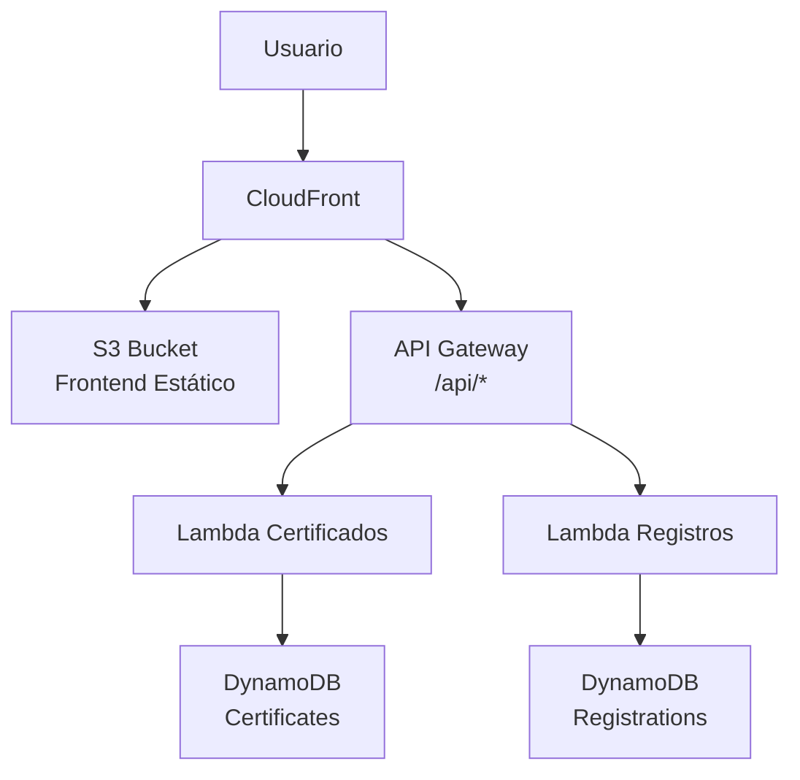

## Problema

Una plataforma de cursos virtuales presentaba fallos críticos durante procesos clave como el registro de nuevos usuarios y la emisión de certificados al finalizar los cursos. Durante periodos de alta demanda —como el cierre de ciclos formativos o inscripciones masivas—, el sistema sufría demoras significativas, errores intermitentes y saturación en los servicios encargados del almacenamiento y procesamiento de solicitudes. Esta inestabilidad afectaba la experiencia de los usuarios, generaba pérdidas de confianza y dificultaba el escalado eficiente del servicio ante el crecimiento de la base estudiantil.

## Descripción Técnica de la Infraestructura en AWS

Esta infraestructura, desplegada mediante Terraform, implementa un sistema de gestión de certificados y registros de usuarios utilizando servicios serverless de AWS. Está organizada en módulos funcionales que integran **API Gateway**, **AWS Lambda**, **DynamoDB**, **CloudFront** y **S3**, con seguridad habilitada mediante **IAM** y **KMS**.

### 1. API Gateway

Se define un `Rest API` llamado `RecursosAPI` con dos endpoints:

* `POST /certificados`: Integrado con una función Lambda para procesar certificados.
* `POST /registros`: Integrado con otra función Lambda que maneja registros de usuarios.

Ambos endpoints están expuestos bajo el **stage prod**. Se establecen permisos explícitos para permitir a API Gateway invocar las funciones Lambda correspondientes.

### 2. Funciones Lambda

Se crean dos funciones en Node.js 16.x:

* **certificates:** Gestiona lógica relacionada con certificados, utilizando la tabla DynamoDB `Certificates`.
* **registrations:** Maneja el registro de usuarios, almacenando datos en la tabla `Registrations`.

Cada función incluye variables de entorno para acceder a sus respectivas tablas y se despliega desde un archivo `.zip` empaquetado localmente.

### 3. DynamoDB

Se implementan dos tablas:

* **Certificates**: Usa certificateId como clave primaria. Contiene índices secundarios globales (UserIdIndex, StatusIndex) para búsquedas avanzadas.
* **Registrations**: Usa una clave compuesta userId + email. Incluye índices para email y accountType.

Ambas tablas cuentan con:

* Encriptación con KMS.
* Configuración de TTL (expirationDate).
* Recuperación ante desastres con Point-in-Time Recovery (solo Registrations).

### 4. CloudFront

Se configura una distribución con dos orígenes:

* **S3**: Para servir archivos estáticos de la aplicación web.
* **API Gateway**: Para enrutar llamadas a /api/* hacia la API REST.

El comportamiento por defecto sirve desde S3 y el comportamiento ordenado enruta /api/* hacia API Gateway. Se usa un certificado SSL proporcionado por CloudFront.

### 5. Seguridad y Roles (IAM & KMS)

* Cada función Lambda tiene su propio execution role, con políticas adjuntas para acceder a:

  * DynamoDB.
  * KMS (para desencriptar datos).
  * CloudWatch Logs.

Se define una **clave KMS personalizada** para encriptar la tabla de registros. La política de la clave otorga acceso tanto al rol de Lambda como al propietario de la cuenta.

# Diagrama de Arquitectura

